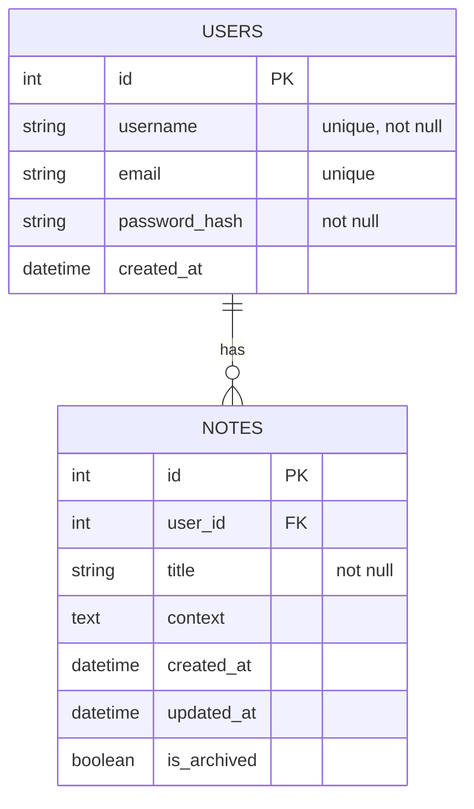

Concept Build a REST API that lets users store, tag, search, and manage notes or knowledge entries (like a lightweight personal wiki or PKM backend). This is realistic, simple, and covers all core REST operations. 

## ERD

